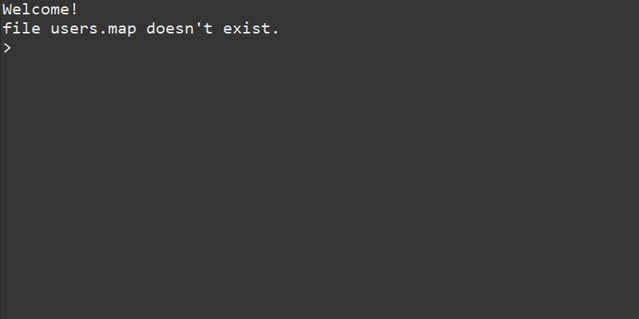
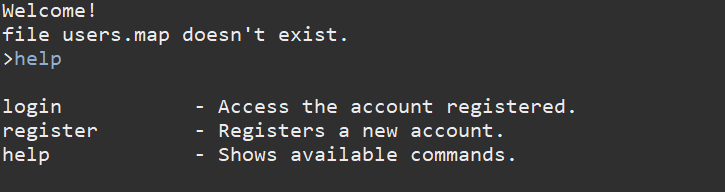
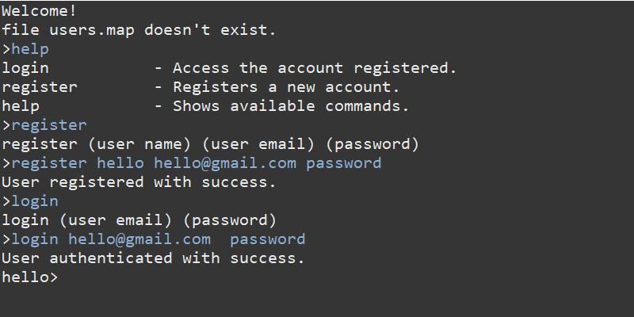
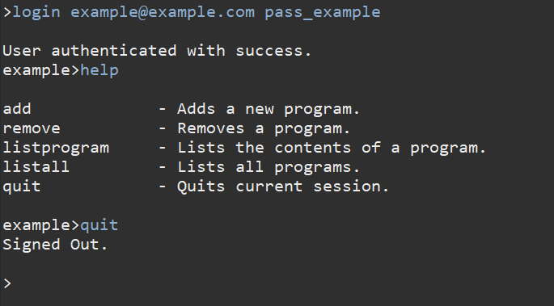

# Password-Manager

Program that stores passwords in a local file called users.map. 

The file is only written upon console exit. 

It manages multiple users' passwords.

Run the file by executing Main.java.

Its a console based program.

Type help to see available commands.

# Installation
  I developed this using eclipse 2019-12 https://www.eclipse.org/downloads/download.php?file=/oomph/epp/2019-12/R/eclipse-inst-win64.exe
  
  
  Using java JDK 1.13 https://www.oracle.com/technetwork/java/javase/downloads/jdk13-downloads-5672538.html

# Using it

This is the screen when you run it for the first time. Don't worry about **file users.map doesn't exist.** because that is the file that saves the users. Since it is the first time running there is no file.

Typing **help** will prompt with the commands available.

Logging in and registering is very simple.

This are the commands available when in session.

