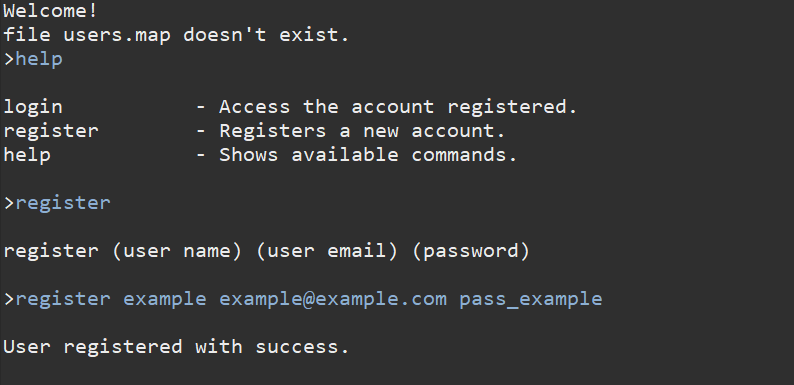

# Password-Manager

Program that stores passwords in a local file called users.map. 

The file is only written upon console exit. 

It manages multiple users' passwords.

Run the file by executing Main.java.

Its a console based program.

Type help to see available commands.

# Installation
  Developed using Eclipse 2019-12: https://www.eclipse.org/downloads/download.php?file=/oomph/epp/2019-12/R/eclipse-inst-win64.exe
  
  
  Java JDK 1.13: https://www.oracle.com/technetwork/java/javase/downloads/jdk13-downloads-5672538.html

# Demo

The program shows the console window. If running for the first time, the following text will appear: **file users.map doesn't exist.**. Being that the first time there is no file that saves the users. Once you save something the message will disapear. The file should be on the same directory as the project-

Typing **help** will prompt with the commands available.

Register a user by typing register, followed by a name, an email, and a password

Login by using an already registered email, and its corresponding password.

This are the commands available when in session.

